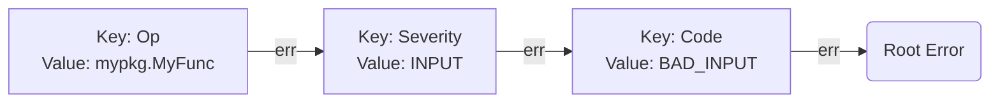

# errors

[](https://pkg.go.dev/github.com/arquivei/errors)
[](https://goreportcard.com/report/github.com/arquivei/errors)
[](https://opensource.org/licenses/BSD-3-Clause)

A golang package to create meaningful errors.

This package allows to inject any type of values into the errors.

## TL;DR Using the `errors` package

Import the package:

``` go
import (
	"github.com/arquivei/errors"
)
```

Use `errors.With()`:

``` go
func doStuff() error {
	// Custom Op, this will override the automatic behavior that is to add the
	// full name of the current function as the Op.
	const op = errors.Op("doStuff")

	err := errors.Errorf("some error")

	return errors.With(err,
		errors.SeverityRuntime, op,
		errors.Code("RUNTIME_ERROR"),
		errors.KV("context1", "value1"),
		errors.KV("context2", "value2"),
	)
}

func inAnotherPlace() {
	err := doStuff()
	fmt.Println(err.Error())
	// Prints: some error
	fmt.Println(errors.Format(err))
	// Prints: doStuff: [runtime] (RUNTIME_ERROR) some error {context2=value2, context1=value1}
}
```

You can use an option pattern to build the error:

``` go
	// Start with an empty slice or one with default values
	errorOpts := []errors.KeyValuer{}
	// Add more values as needed...
	// if ... then add key1
	errorOpts = append(errorOpts, errors.KV("key1", "value1"))
	// if ... then add Severity
	errorOpts = append(errorOpts, errors.SeverityInput)
	// Build the final error and return
	return errors.With(err, errorOpts...)
```

Fetch values with `errors.Value*` functions:

``` go
// Examples on how to retrieve values
val := errors.Value(err, mykey)
valStr := errors.ValueT[string](err, mykey)

code := errors.GetCode(err)
severity := errors.GetSeverity(err)
```

## Core concepts

The `errors.Error` is a combination of a an `error` and a key-value pair, much 
like a `context.Context`:

``` go
type Error struct {
	err    error
	keyval KeyValuer
}

```

The key-value pair is any type that implements the `KeyValuer` interface:

``` go
type KeyValuer interface {
	Key() any
	Value() any
}
```

> Tip: It helps if the key and value both implement the `fmt.Stringer`
> interface (`String() string`).
> This will help the error formatter to print the key-value pair during calls
> to `Error() string`.

The `errors.With()` functions will wrap the given error with a list of 
key-values. If more than one key-value is given, they will be chained together.



## Built-in KeyValuers

This package provides some built-in key-values.

### Op (Operation)

The operation (or function) that was running when the error was reported.

This is used to make a call stack of operations being performed when the error 
occurred.

It is set automatically by `errors.With()` with the name of the function, as 
reported by the go's `runtime` package. It can be overwritten by passing
`errors.Op("your op")` to `errors.With()`. 

When adding Op automatically,  it checks the most recent `Op` before adding a
new one so it does not stack repetitive functions names.

This can be disabled by setting `errors.AutomaticallyAddOp = false`.

### Severity 

This can be used to indicate the severity of an error. It can be:

- Input
- Runtime
- Fatal

`Input` indicates that the error was caused by bad input. The operation should
not be retried and whoever called this function should be notified to not send
this input again. In HTTP language, this should translate to a status code 400.

`Runtime` indicates that something outside the application failed. A retry would
probably change the outcome. For example, a timeout when connection to the 
database.

`Fatal` indicates that the code was not ready do handle this and the developers
should be notified about an error on their application.

### Code

This is a simple string to be used as error codes so your application can 
differentiate errors. 

Whoever receives this error code should write a switch case to handle the 
different possible codes.

``` go
switch errors.GetCode(err) {
	case MyCode1:
		// handle MyCode1
	case MyCode2:
		// handle MyCode2
	default:
		// handle unknown code
}
```

### KV

This is an arbitrary key-value pair that can be used to inject extra context in
the error.

All values are printed by the default error formatter as `{key=value, ...}`.

The key can be any comparable value.

### Formatter

This is a special type that changes the behavior of `Error() string`  function.

This can be used to change how the error is printed. For example, we would want
the full error message in the logs but only the root error when returning 
through an API.

``` go
err = errors.With(err, errors.RootErrorFormatter))
```

The `errors.FullFormater` is the default and will print something like (from the
example package):

``` text
 customOpExample: main.doGreetings.func1 (main.go:58): main.doGreetings: main.greetings: main.greeter[...].sayHello: [fatal] (RUNTIME_ERROR) name cannot be empty {context3=value3, context2=value2, context1=value1}
```

The `errors.RootErrorFormatter` will only print the root error:

``` text
name cannot be empty
```

And there is a variation `errors.RootErrorKVFormatter` that will print the 
root error with the KV as context.

``` text
name cannot be empty {context3=value3, context2=value2, context1=value1}
```

